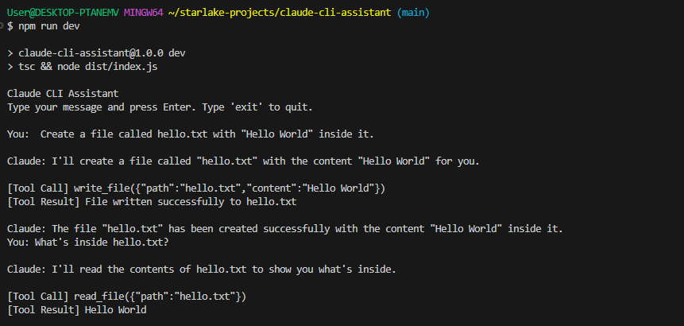
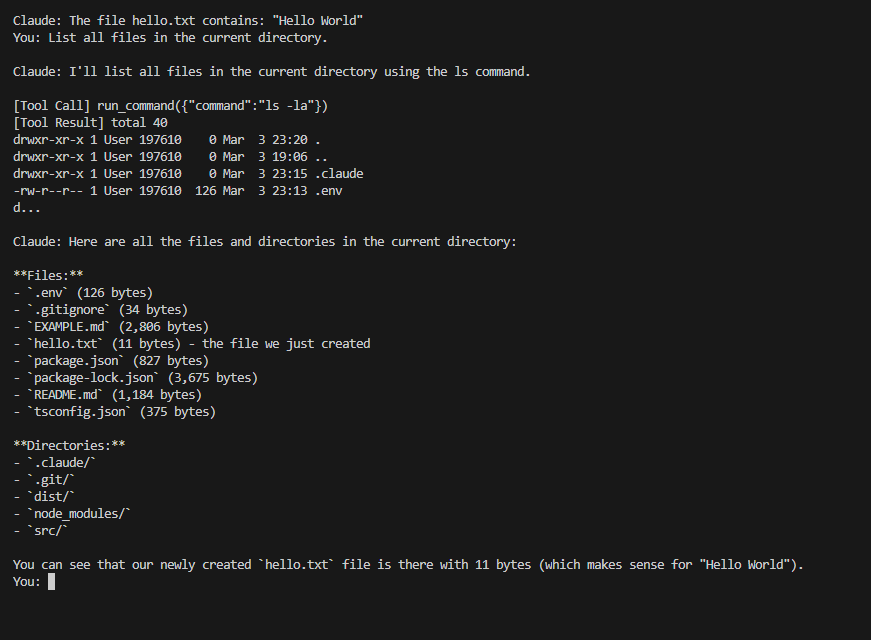

# Usage Example

## Running the Dry-Run Test

The current implementation sends a test message to Claude along with the tool definitions to verify that the API connection works and Claude can see the available tools.

### Step 1: Set Your API Key

Create a `.env` file in the project root:

```
ANTHROPIC_API_KEY=your-api-key-here
```

> The `.env` file is already in `.gitignore` so your key won't be committed.

### Step 2: Build and Run

```bash
npm run dev
```

### Step 3: Review the Output

The program prints the full JSON response from the Claude API. A successful response looks like this:

```json
{
  "id": "msg_01AbCdEfGhIjKlMnOp",
  "type": "message",
  "role": "assistant",
  "model": "claude-sonnet-4-20250514",
  "content": [
    {
      "type": "text",
      "text": "Yes! I can see three tools:\n\n1. **read_file** — Reads the contents of a file at a given path.\n2. **write_file** — Creates or overwrites a file with the provided content.\n3. **run_command** — Executes a shell command and returns stdout/stderr."
    }
  ],
  "stop_reason": "end_turn",
  "usage": {
    "input_tokens": 320,
    "output_tokens": 85
  }
}
```

### What to Look For

| Field | Meaning |
|-------|---------|
| `content[].type` | `"text"` means Claude responded with plain text. `"tool_use"` means Claude wants to invoke a tool. |
| `stop_reason` | `"end_turn"` means Claude finished its response. `"tool_use"` means Claude is waiting for a tool result before continuing. |
| `usage` | Token counts for the request — useful for tracking API costs. |

## Interactive Chat Session

The CLI assistant supports an interactive chat loop where you can ask Claude to read files, write files, and run commands. Here's what a real session looks like:





## Understanding the API Response Structure

```
Response
├── content[]                 ← Array of content blocks
│   ├── { type: "text" }      ← Plain text from Claude
│   └── { type: "tool_use" }  ← Tool invocation request
│       ├── id                ← Unique ID for this tool call
│       ├── name              ← Which tool to run (e.g. "read_file")
│       └── input             ← Parameters for the tool (e.g. { path: "hello.txt" })
├── stop_reason               ← Why Claude stopped: "end_turn" or "tool_use"
└── usage                     ← Token usage for billing
    ├── input_tokens
    └── output_tokens
```
